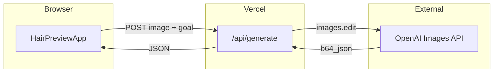

# Plan: Hair Hack

**Derived from:** [SPEC.md](./SPEC.md)  
**Status:** Phase 1 ready — clinic demo, English only, team repo

---

## Architecture



### Design decisions

| Decision | Choice | Rationale |
|----------|--------|-----------|
| Image transport | Base64 in JSON | Simple MVP; revisit multipart if payload size hurts |
| State | React `useState` only | No global store until history/sharing |
| Generation | Sync request | OpenAI edit is one-shot; add job queue only if p95 > 120s |
| Prompt strategy | Static per goal | Easy to tune; A/B table in Phase 2 |
| Auth | None until Phase 2 | Reduces scope; rate limit by IP instead |

### Risks

| Risk | Likelihood | Mitigation |
|------|------------|------------|
| OpenAI cost spike on viral traffic | Medium | IP rate limit + daily cap env var |
| Poor/unrealistic previews | High | Prompt iteration + fixture QA rubric |
| Face drift / wrong person | Medium | Strong negative prompts; reject obvious failures |
| API timeout on large images | Medium | Client resize before upload (Phase 1) |
| Legal (medical claims) | Medium | Disclaimer + "illustrative only" copy |

---

## Phase 0 — MVP scaffold ✅

**Goal:** Prove the loop works end-to-end.

**Delivered:**
- Next.js 15 + Tailwind 4
- `HairPreviewApp` with upload, goals, before/after
- `POST /api/generate` → OpenAI `images.edit`
- Env-based model selection

**Exit criteria:** `npm run build` passes; manual happy path with valid API key.

---

## Phase 1 — Foundation (clinic demo ready)

**Goal:** Reliable demo consultants can use in-clinic; repo ready for team PRs.

### 1.0 Team & repo
- GitHub private repo; collaborators invited — [COLLABORATION.md](./COLLABORATION.md)
- `git init` + initial commit; branch protection on `main` (optional)
- Shared dev `OPENAI_API_KEY` via password manager

### 1.1 Quality & tests
- Add Vitest; unit tests for `parseDataUrl`, goal validation, prompts
- Mock OpenAI in API route tests
- Add `npm test` script

### 1.2 API hardening
- Extract validation to `src/lib/validate.ts`
- Map OpenAI errors to stable user messages (quota, content policy, timeout)
- Optional: client-side image resize (max 2048px) before upload

### 1.3 Security & cost (moderate budget)
- IP rate limiting (e.g. 15–30/hour/IP for demo kiosks)
- Env: `DAILY_GENERATION_CAP`, `RATE_LIMIT_PER_HOUR`, `OPENAI_IMAGE_MODEL`
- Document estimated $/generation in README (track after first 50 runs)

### 1.4 Clinic demo UX
- Before/after **slider** (primary compare mode for consultations)
- Consent checkbox + prominent disclaimer (illustrative only, not medical advice, data → OpenAI)
- Copy tuned for **in-clinic** use ("Show your client…", not "Sign up")
- Loading: progress + cancel; works on clinic tablet (768px+)

### 1.5 DevOps
- GitHub Actions: `build` + `test`
- `.env.example` documents all vars

**Phase 1 exit criteria:**
- All P1–P6 success criteria from SPEC met
- CI green
- 3 fixture photos pass manual QA checklist

---

## Phase 2 — Clinic product

**Goal:** Each clinic can brand and share the demo.

- Clinic branding (logo, accent color via env or config file)
- Embeddable `/embed` or fullscreen kiosk mode
- Download result PNG for consultation notes
- Prompt lab (env-gated) + `docs/QA-RUBRIC.md`
- Privacy policy page (template)

---

## Phase 3 — Scale

**Goal:** Multiple clinics, measured rollout.

- Per-clinic config (subdomain or query param)
- Lead capture (email + consent) → webhook
- Analytics (events only, no images)
- Multi-seat auth (if needed)

---

## Phase 4 — Ship

**Goal:** Production on custom domain with monitoring.

- Vercel production deploy
- Environment promotion (preview → prod)
- Error tracking (Sentry)
- Cost dashboard (OpenAI usage)
- Canary: health check on `/api/health`
- Launch checklist per `shipping-and-launch` skill

---

## Dependency graph (Phase 1)

```
1.1 Tests ──────────────┐
1.2 API hardening ──────┼──► 1.5 CI
1.3 Rate limit ─────────┤
1.4 UX (slider, i18n) ──┘
```

**Parallelizable:** 1.1 + 1.4 UI mockups; 1.2 + 1.3 after shared `validate.ts` exists.

---

## Verification checkpoints

| After | Check |
|-------|-------|
| Each task | `npm run build` (+ `npm test` when available) |
| Phase 1 complete | Playwright smoke + 3-photo manual QA |
| Pre-ship | `security-and-hardening` checklist |
| Post-ship | 24h error rate < 1%, p95 latency logged |

---

## What we are NOT doing yet

- Database
- User accounts
- Payments
- Native apps
- Custom ML models
- Automatic Norwood classification
